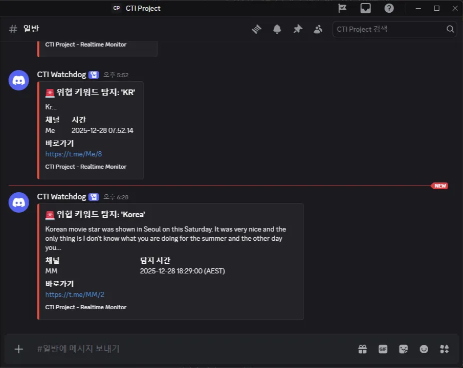
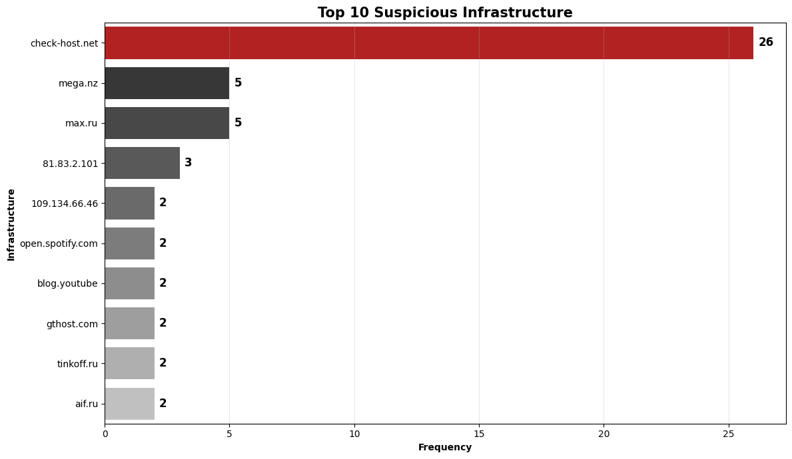
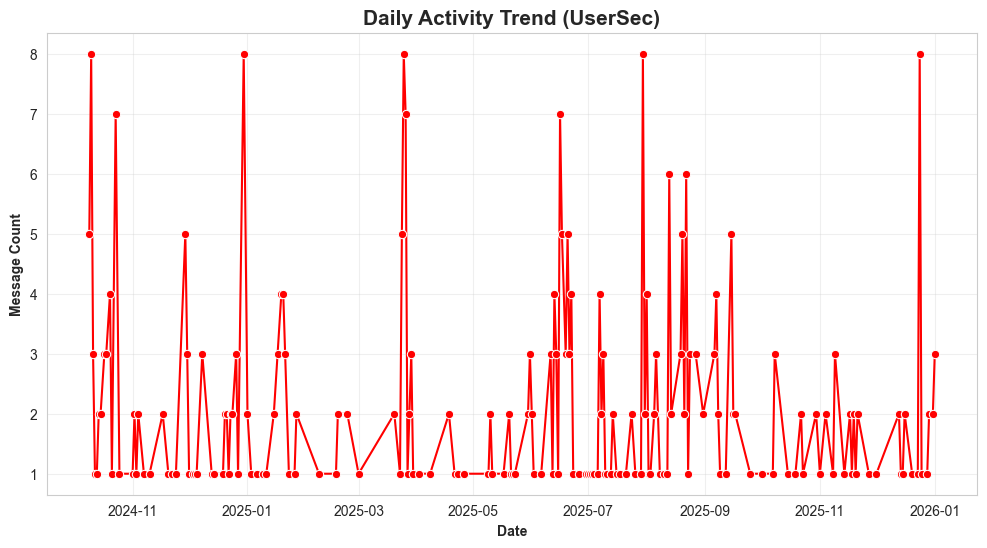

# 🕵️‍♂️ Telegram Threat Intelligence Pipeline


## 📖 Project Overview
**러시아 핵티비스트 그룹의 텔레그램 채널을 실시간으로 감시, 분석하여 위협 인텔리전스를 생산하는 CTI 자동화 시스템**입니다. <br><br>
단순 수집 및 번역을 넘어, 비정형 텍스트에서 침해지표(IOC)를 정밀 추출하고 시각화하여 실제 보안 관제에 적용 가능한 데이터를 제공합니다.

> **Target:** UserSec (Russian Hacktivist Group) <br>
> **Goal:** 잠재적인 한국 대상 사이버 위협(DDoS, Deface)을 조기에 탐지하고 공격 인프라 정보를 신속하게 추출한다.

## 🚀 Key Features
### 1. 📌 Data Collection & Engineering
- **Batch Scraping (`main_scraper.py`):** 과거 메시지를 전부 수집하여 MongoDB에 적재.
- **Real-time Monitoring (`realtime_monitor.py`):** 24시간 가동되며 새로운 위협 정보를 실시간으로 수집.
- **Idempotency (중복 방지):** 서비스 재시작 시 중복 알림/중복 저장을 방지하는 로직 구현.

### 2. 💡 Natural Language Processing (NLP)
- **Auto Translation (`translator.py`):** 수집된 러시아어`Ru` 데이터를 한국어`Kr`로 자동 번역하여 분석 가독성 확보.
- **Incremental Processing:** 미번역된 데이터만 선별하여 처리함으로써 API 효율성 극대화.

### 3. 🚨 Alerting & Dissemination
- **Keyword Filtering:** `Korea`, `DDoS`, `Attack` 등 고위험 키워드 탐지.
- **Discord Integration:** 위협 감지 시 Discord Webhook을 통해 즉시 알림 발송 (UTC -> AEST 시간 변환 적용).
- **OpSec Safety:** 수집용 계정 `텔레그램`과 알림용 채널 `디스코드`를 분리하여 운영 보안(OpSec) 확보.

### 4. 📈 Threat Analysis & Visualization
- **Temporal Analysis:** `Daily Activity Trend`, `Activity Time Analysis`를 통한 시계열 및 활동 시간 분석.
- **Content Analysis:** `Threat Topic Analysis`, `Threat Keyword Frequency`를 통한 위협 주제 분석.
- **IOC Analysis:** URL, IP, Email, BTC를 패턴 기반으로 식별 후 추출하여 위협 인프라 시각화 및 CSV 포맷 제공.

## 🛠️ Tech Stack & Environment
| Category | Tech / Libraries | Usage |
| :--- | :--- | :--- |
| **Language** |  | 전체 파이프라인 개발 |
| **Database** |  | 텔레그램 비정형 데이터 적재 및 관리 (NoSQL) |
| **Data Analysis** | `Pandas` | 데이터 전처리 |
| **Visualization** | `Matplotlib`, `Seaborn` | 시각화 |
| **NLP & Text** | `Re`, `Deep-translator` | 정규식 패턴 매칭 및 다국어 자동 번역 |
| **Collection & Alert** | `Telethon`, `Requests` | 텔레그램 API 수집 및 디스코드 알림 전송 |

## 📂 Project Structure
```bash
CTI_Project/
├── config.py             # 환경 변수 및 DB 연결 설정
├── main_scraper.py       # 과거 데이터 배치 수집 모듈
├── realtime_monitor.py   # 실시간 위협 감지 및 알림 봇
├── translator.py         # 러시아어 -> 한국어 자동 번역 모듈
├── analysis.ipynb        # 데이터 시각화 및 위협 분석 노트북
├── requirements.txt      # 프로젝트 의존성 라이브러리 목록
├── .env                  # API Key 및 민감 정보 (Git 제외)
├── .gitignore            # 보안 설정 (Session, Pycache 제외)
└── README.md             # 프로젝트 문서
```

## 📊 Analysis Outputs
| 🚨 Real-time Discord Alert | 🗄️ MongoDB Data Structure |
| :---: | :---: |
|  |  |
| **[실시간 대응]** 키워드 탐지 | **[데이터 엔지니어링]** 원본/번역 데이터 통합 관리 |

| 🛡️ Top 10 Threat Infrastructure | 📈 Daily Activity Trend |
| :---: | :---: |
|  |  |
| **[IOC 분석]** 주요 위협 인프라 식별 | **[시계열 분석]** 공격 캠페인 발생 시점 추적 |

## ⚠️ Disclaimer
이 프로젝트는 사이버 보안 연구 및 학습 목적으로 개발되었습니다. <br>
수집된 데이터는 분석 목적으로만 사용됩니다.